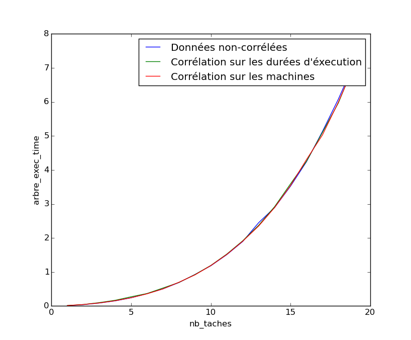

# COMPLEX-Project-1

## *Partie 1 : algorithme approché avec garantie de performance*

#### Question 1
Soit $I$ une instance à notre problème, et $P$ une permutation arbitraire des tâches de $I$, on a :

$$\sum_{i \in I}d_A^i + d_B^i + d_C^i = \sum_{i \in I}d_A^i + \sum_{i \in I}d_B^i + \sum_{i \in I}d_C^i$$

Et la propriété de la somme nous donne :

$$\sum_{i \in I}d_A^i + \sum_{i \in I}d_B^i + \sum_{i \in I}d_C^i \leq 3*max\{\sum_{i \in I}d_A^i, \sum_{i \in I}d_B^i, \sum_{i \in I}d_C^i\} \quad (1)$$

Or nous savons que  la durée optimale de notre problème d'ordonnancement est supérieure ou égale à la somme des durées quelque soit la machine, soit :
$$max\{\sum_{i \in I}d_A^i, \sum_{i \in I}d_B^i, \sum_{i \in I}d_C^i\} \leq OPT \quad (2)$$

Donc grâce à $(1)$ et $(2)$, nous avons :
$$OPT \geq \frac{\sum_{i \in I}d_A^i + d_B^i + d_C^i}{3}$$

Soit  
$$3 \geq \frac{\sum_{i \in I}d_A^i + d_B^i + d_C^i}{OPT}$$

$\sum_{i \in I}d_A^i + d_B^i + d_C^i$ est une borne supérieur des solutions possibles de $P$.
Donc l'ordonnancement associé à P est donc 3-approché.

#### Question 2 : algorithme de Johnson

De même manière que dans la question 1, $\sum_{i \in I}d_A^i + d_B^i$ est une borne supérieure aux solutions possibles de la permutation.

On a donc :
$$2 \geq \frac{\sum_{i \in I}d_A^i + d_B^i}{OPT}$$

L'ordonnancement obtenu est donc 2-approché.

La complexité de cet algorithme est linéaire, car à chaque itération on choisit la tâche dont la durée dans la machine A ou dans la machine C est minimale.

## *Partie 2 Méthode exacte*

Conditions Initiales

- $\pi$ = début de la permutation des tâches
- $t_A^\pi$  = durée pour traiter $\pi$ tâches sur $M_A$
- $t_B^\pi$ = durée pour traiter $\pi$ tâches sur $M_A$ et $M_B$
- $t_C^\pi$ = durée pour traiter $\pi$ tâches sur $M_A$ et $M_B$ et $M_C$

$$ b_A^\pi = t_A^\pi + \sum_{i \in \pi' }d_A^i + min_{i \in \pi'}\{d_B^i + d_C^i\} $$
$\Rightarrow$ On choisit une tache $i \in \pi'$ tq  $d_B^i + d_C^i$ soit min pour " finir rapidement à la fin"

de même manière,

$$b_A^\pi = t_C^\pi + \sum_{ i \in \pi'}d_C^i $$
$$b_B^\pi = t_B^\pi + \sum_{i \in \pi'}d_B^i + min\{d_C^i\}$$

### Question 4

soit $k$ la première tâche de $\pi'$

La tache $k$ ne peut pas commencer dans la machine $B$ avant sa fin dans la machine $A$

donc

pour $t_A^\pi + min_{i \in \pi'} \{d_A^i\} > t_B^\pi$

$$b_B^\pi = t_A^\pi + min_{i \in\pi'} \{d_A^i\}  + \sum_{i \in \pi'}d_B^i + min\{d_C^i\}$$

est toujours une borne inferieure du temps d'execution des tâches.

De même $t_C^\pi$ est remplacable par $max \{t_C^\pi ,t_B^\pi + min_{i \in \pi'}\{d_B^i\}, t_A^\pi +min_{i \in \pi'}\{d_A^i + d_B^i\}\}$

car la machine C ne peut pas commencer a traiter la tache $k$ avant que la fin de son traitement dans la machine B

### Question 5

montrez que $\forall P$ permutation des tâches commençant par $\pi$

$\forall k\in \pi'$
$$ C_M^P \geq t_A^\pi + (d_A^k+d_B^k+d_C^k) + \sum_{i \in \pi' /k}min\{d_A^i,d_C^i\} $$

**Réponse**

- $t_A^\pi$ = durée de la permutation $\pi$
- $(d_A^k+d_B^k+d_C^k)$ = durée minimale de la tâche $k$

- Il y a 3 cas :
  1. quand k est la première tâche de $\pi'$
  2. quand k est la dernière tâche de $\pi'$
  3. quand k est au milieu

1e cas: on ne compte que $\{d_C^i\}$
2e cas : on ne compte que $\{d_A^i\}$
3e cas : on compte $\{d_A^i\}$ avant la tâche k et $\{d_C^i\}$ après la tâche k

### Question 6

Avec la Question 5, on a :
$$ b_A' = t_A^\pi + (d_A^k+d_B^k+d_C^k) + \sum_{i \in \pi' /k}min\{d_A^i,d_C^i\} $$
de même manière, on a
$$ b_B' = t_B^\pi + (d_A^k+d_B^k+d_C^k) + \sum_{i \in \pi' /k}min\{d_B^i,d_C^i\} $$

$$ b_C' = t_C^\pi + (d_A^k+d_B^k+d_C^k) + \sum_{i \in \pi' /k } d_C^i $$

### Question 8

On peut classer les données en fonction des durées des tâches dans les machines $A$, $B$ et $C$, ce qui va réduire le temps de recherche par rapport à une méthode dont l'ordre de recherche des permutations est aléatoire. Par exemple on peut prioritiser la recherche sur les tâches dont la durée dans la machine $A,B$ et $C$ est la plus petite.

### Question 9
Par récurrence on peut trouver tous les minorants $b_J'$ où J est une machine quelle conque parmi les $k$ machines. Donc on peut adapter cette méthode arborescente à $k$ machines. Cependant la compléxité temporelle va augmenter de façon exponentielle (avec chaque machine, le nombre de noeuds de l'arbre de recherche augemente aussi), donc cette méthode n'est peut être pas adapté à un nombre $k$ très grand.

### Question 10

Le succès de la méthode dépend essentiellement de la précision de la fonction d’évaluation.
On peut l’accélérer en se contentant d’une solution approchée avec garantie de qualité. On peut décider d’élaguer tout nœud dont l’évaluation est inférieure à (1 - $\alpha$) fois la valeur de la meilleure solution courante.
Par exemple si $\alpha$ = 0.05, alors quand on s’arrêtera la valeur de la solution trouvée sera à moins de 5% de l’optimum.

## *Partie 3 : Analyse expérimentale et étude comparative des différentes méthodes*

### Comparaision entre les deux méthodes :

1. par rapport au nombre de tâches
+ La qualité des solutions retournées
+ la compléxité temporelle

2. par rapport au nombre de machines

### Test de performance sur les différents types de tâches

")
")
